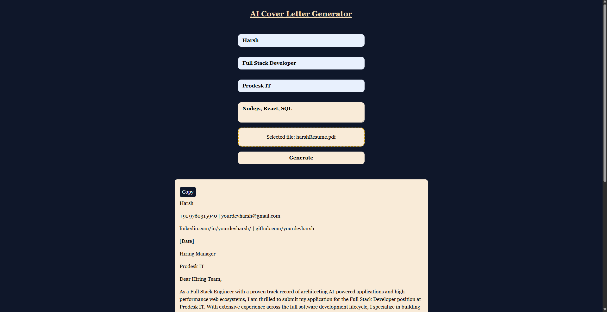
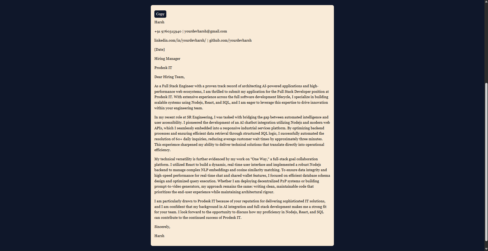

# AI Cover Letter Generator (SaaS)

A Full-Stack AI-powered SaaS application built for the Prodesk IT Sprint 04 Allocation. 

This application ingests user parameters (Name, Target Company, Role, Key Skills) along with a PDF upload of their resume. It parses the PDF data securely on a Node.js backend and utilizes the **Google Gemini API** to programmatically engineer a highly personalized, STAR-method aligned cover letter.

Live Link is not available because project uses backend architecture.

---

## 📸 Screenshots

| Upload & Input Interface | Generated Cover Letter |
| :---: | :---: |
|  |  |

---

## ✨ Features Built (Meeting Sprint 04 Requirements)

### Phase 1: Base MVP & State Logic
* **Dynamic Form Architecture:** Captures essential user data including Name, Job Role, Target Company, and specific Key Skills.
* **Responsive UI:** Built with Tailwind CSS, featuring a clean, dark-mode focused aesthetic fitting for modern SaaS tools.
* **UX Polish:** Includes "Generating..." loading states, formatted paragraph rendering (`\n` splitting), and a 1-click **Copy to Clipboard** utility.

### Phase 2: LLM Integration & Security
* **Gemini API Integration:** Connects seamlessly to the `gemini-3-flash-preview` model to generate context-aware cover letters.
* **Advanced Prompt Engineering:** Uses backend `systemInstruction` configurations to assign the AI an "Executive Career Coach" persona, enforcing strict structural constraints (Hook, STAR method body, strong call-to-action) and forbidding generic filler text.
* **Full-Stack Security Architecture:** The React frontend **never** touches the API key. All LLM calls are routed through a dedicated Express backend, with the API key safely secured in a `.env` file to prevent client-side exposure.

### Phase 3: SaaS Level Capabilities
* **File Parsing Pipeline:** Implemented a custom Drag-and-Drop zone for PDF uploads.
* **PDF Extraction:** Utilizes `multer` (memory storage) and `pdf-parse` on the Node server to extract raw text strings directly from the user's resume buffer.
* **Dynamic Contextualization:** Injects the extracted resume text into the LLM payload, ensuring the generated cover letter references actual, real-world candidate experience rather than hallucinated filler.

---

## 🛠️ Tech Stack

**Frontend:**
* React.js (Vite)
* Tailwind CSS
* HTML5/FormData API

**Backend:**
* Node.js & Express.js
* `@google/genai` (Google Gemini SDK)
* `multer` (Multipart/form-data parsing)
* `pdf-parse` (PDF text extraction)
* `cors` & `dotenv`

---

## 🚀 Local Installation & Setup

Because this project utilizes a secure backend architecture, you must run both the server and the client to test it locally.


### Backend Setup

1. Navigate to the backend directory:
    ```bash
    cd backend
    ```

2. Install dependencies:
    ```bash
    npm install
    ```

3. Create a `.env` file in the root of the backend folder and add your Gemini API Key and Port:

    ```env
    API_KEY=your_gemini_api_key_here
    PORT=3000
    ```

4. Start the server:

    ```bash
    node index.js
    ```

5. Server should run on:

    ```txt
    http://localhost:3000
    ```

---

### 2. Frontend Setup (React/Vite)

1. Open a new terminal window and navigate to the frontend directory:

    ```bash
    cd frontend
    ```

2. Install dependencies:

    ```bash
    npm install
    ```

3. Start the Vite development server:

    ```bash
    npm run dev
    ```

4. App should run on:

    ```txt
    http://localhost:5173
    ```


Designed and developed by **Harsh Kashyap** for the **Prodesk IT Sprint 04 Mission**.